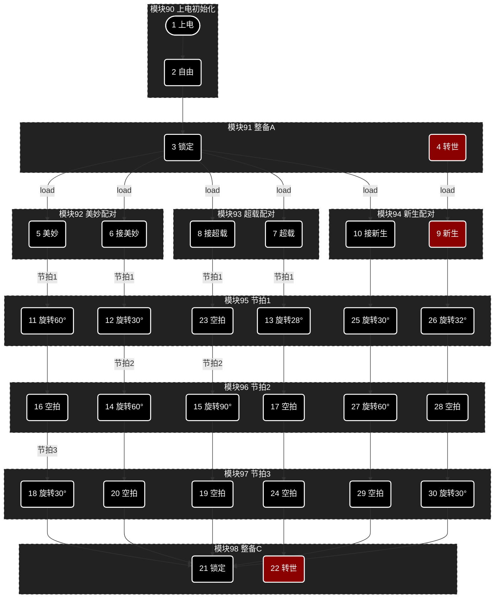
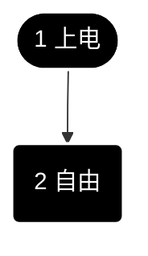
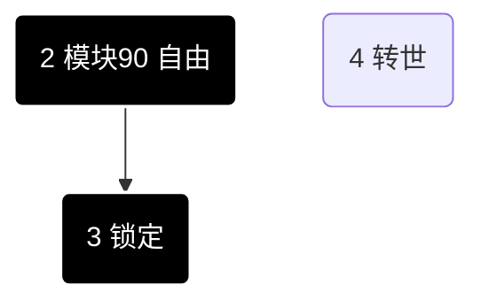
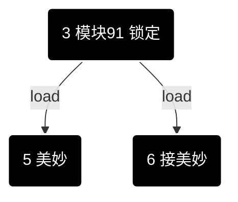
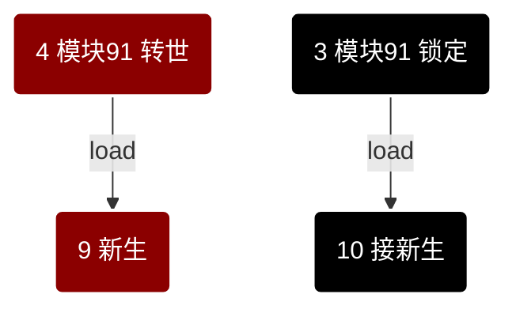
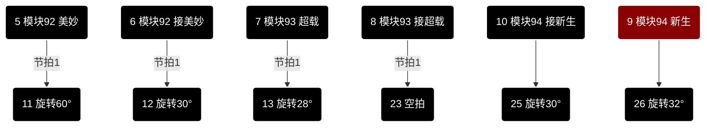
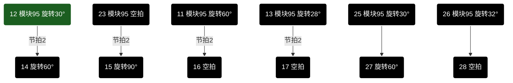
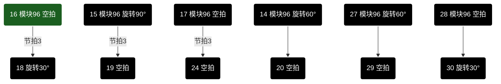
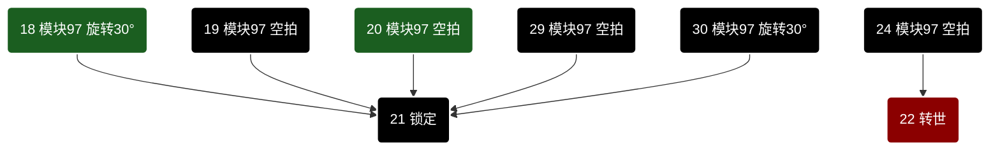

# 节拍状态图

> 全新定义的流程文档。一次完整的状态流转按九个模块划分，每个模块一张独立状态图。
> 模块编号从90开始（90~98），卡片编号从1开始（1~30），画线时可直接用「编号到编号」描述。
> 节拍模块内的元素统称「旋转」。

## 总图

## load 配对判定

动作以**供方→接收方**成对产生（接收方 = 供方右侧相邻轮，编号减一），要么成对、要么整对不产生：

- 成对条件：接收方处于**锁定**、接收方为空（count=0）、接收方的右侧无料（可解锁）。
- 锁定 + count=1 → **美妙 + 接美妙**；锁定 + count≥2 → **超载 + 接超载**；转世 → **新生 + 接新生**。
- 不成对则双方保持原状态（供方保持锁定/转世），本拍均不动。
- 1号轮的右侧为出料口（虚拟接收位，永远为空、可解锁）：1号轮永远可以配对出料；它自身有料时不能作为接收方。

## 编号对照表

| 编号 | 卡片 | 所属模块 |
|---|---|---|
| 1 | 上电 | 模块90 上电初始化 |
| 2 | 自由 | 模块90 上电初始化 |
| 3 | 锁定 | 模块91 整备A |
| 4 | 转世 | 模块91 整备A |
| 5 | 美妙 | 模块92 美妙配对 |
| 6 | 接美妙 | 模块92 美妙配对 |
| 7 | 超载 | 模块93 超载配对 |
| 8 | 接超载 | 模块93 超载配对 |
| 9 | 新生 | 模块94 新生配对 |
| 10 | 接新生 | 模块94 新生配对 |
| 11 | 旋转60° | 模块95 节拍1 |
| 12 | 旋转30° | 模块95 节拍1 |
| 13 | 旋转28° | 模块95 节拍1 |
| 14 | 旋转60° | 模块96 节拍2 |
| 15 | 旋转90° | 模块96 节拍2 |
| 16 | 空拍 | 模块96 节拍2 |
| 17 | 空拍 | 模块96 节拍2 |
| 18 | 旋转30° | 模块97 节拍3 |
| 19 | 空拍 | 模块97 节拍3 |
| 20 | 空拍 | 模块97 节拍3 |
| 21 | 锁定 | 模块98 整备C |
| 22 | 转世 | 模块98 整备C |
| 23 | 空拍 | 模块95 节拍1 |
| 24 | 空拍 | 模块97 节拍3 |
| 25 | 旋转30° | 模块95 节拍1 |
| 26 | 旋转32° | 模块95 节拍1 |
| 27 | 旋转60° | 模块96 节拍2 |
| 28 | 空拍 | 模块96 节拍2 |
| 29 | 空拍 | 模块97 节拍3 |
| 30 | 旋转30° | 模块97 节拍3 |

## 模块90 上电初始化

状态：**自由**（唯一状态，上电后全部托架进入）。

## 模块91 整备A

状态：**锁定、转世**。

## 模块92 美妙配对

状态：**美妙、接美妙**。

跨模块转移：模块91 的 **锁定** →（load）→ 模块92 美妙配对 的 **美妙 / 接美妙**。

## 模块93 超载配对

状态：**超载、接超载**。

跨模块转移：模块91 的 **锁定** →（load）→ 模块93 超载配对 的 **超载 / 接超载**。

## 模块94 新生配对

状态：**新生、接新生**。

跨模块转移：模块91 的 **锁定** →（load）→ 模块94 新生配对 的 **接新生**；模块91 的 **转世** →（load）→ 模块94 新生配对 的 **新生**。

## 模块95 节拍1

元素：**旋转60°（11）、旋转30°（12、25）、旋转28°、旋转32°、空拍（23）**。

## 模块96 节拍2

元素：**旋转60°（14、27）、旋转90°（15）、空拍（16、17、28）**。

## 模块97 节拍3

元素：**旋转30°（18、30）、空拍（19、20、24、29）**。

## 模块98 整备C

状态：**锁定、转世**。

跨模块转移：
- **美妙**：节拍1（旋转60°）→ 节拍2（空拍16）→ 节拍3（旋转30°）→ 整备C **锁定**。
- **接美妙**：节拍1（旋转30°）→ 节拍2（旋转60°）→ 节拍3（空拍20）→ 整备C **锁定**。
- **超载**：节拍1（旋转28°）→ 节拍2（空拍17）→ 节拍3（空拍24）→ 整备C **转世**。
- **新生**：模块94 新生配对 → 节拍1（旋转32°[26]）→ 节拍2（空拍28）→ 节拍3（旋转30°[30]）→ 整备C **锁定**。
- **接新生**：模块94 新生配对 接新生 → 节拍1（旋转30°[25]）→ 节拍2（旋转60°[27]）→ 节拍3（空拍29）→ 整备C **锁定**。
