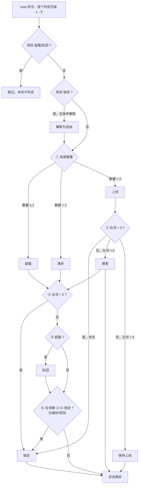
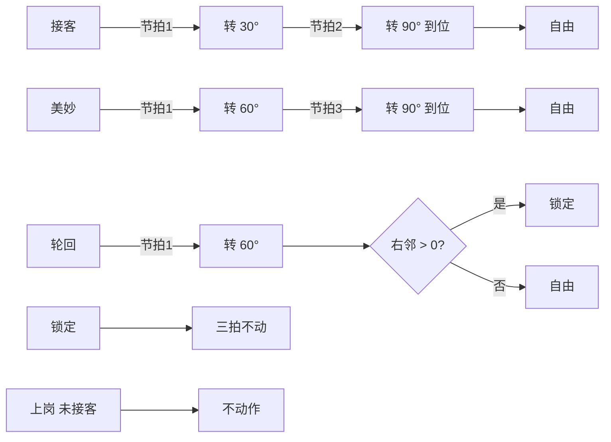

# flux_loader 节拍逻辑详解

> 本文档解释固件"节拍"（beat）的完整执行逻辑，供维护固件与联调上位机时参考。
> 业务规则速览见 [README](../README.md) 第 3 节；命令/应答报文格式见 [通讯协议](通讯协议.md)。
> 按三拍分解的图形化流程见 [节拍状态图](节拍状态图.md)。
> 依据代码：`src/AppProduction.cpp`。
> 第 4 节托架状态机已在固件中实现（2026-09-23），旧的 90°/22.5° 规则已移除。

## 1. 什么是节拍

节拍 = 一个 `load` 命令触发的一次完整物料输送动作：

```
上位机发 load 命令（携带 8 托架芦笋数量）
    → 设备按托架状态机规划动作（30° / 60° / 90° / 不动）
    → 节拍1 → 节拍2 → 节拍3 顺序执行，每拍内 8 路电机同时启动
    → 三拍全部到位后发 done 应答
```

单机调试命令 `motor`（单电机）与 `multi`（8 路角度数组）复用同一节拍生命周期（IDLE→RUNNING→COMPLETED），但不做业务规划，仅按命令直接驱动电机。

## 2. 节拍生命周期（状态机）

```
        load/motor 命令（仅 idle 受理）         全部电机到位
 IDLE ────────────────────────────▶ RUNNING ────────────────▶ COMPLETED
  ▲                                                              │
  │         stop → (调试节拍恢复速度) → 发 done → 发 state:idle    │
  └──────────────────────────────────────────────────────────────┘
```

| 状态 | 行为 | MQTT 输出 |
| :--- | :--- | :--- |
| `IDLE` | 等待命令；收到合法命令即规划并启动 | — |
| `RUNNING` | 按节拍1→2→3 顺序执行，每拍轮询 `isMoving()`，全部电机到位后进入下一拍 | 进入时发 `state: running` |
| `COMPLETED` | 停止电机；调试节拍恢复生产速度参数；发布应答 | `done`（回带 cmd 类型）+ `state: idle`，随后回 `IDLE` |

**并发约束**：`RUNNING` 期间收到的命令一律忽略（仅记 `log`），不做队列缓存。

## 3. 命令受理与校验（load）

1. 仅 `IDLE` 状态受理。
2. JSON 必须含 `"cmd":"load"` 和 `"counts"` 数组；数组解析出 **恰好 8 个 0~255 的整数**，数量不足 8 个、含负数 / 超 255 / 带小数的值时，整帧忽略并记 `log`。
3. 解析成功即改写当前托架状态缓存 `_asparagusCounts[8]`，随后进入运动规划。
4. 业务上只区分 0 / 1 / ≥2 三种状态；数值大小无更细含义。

## 4. 运动规划规则（托架状态机）

数组索引 0-7 对应托架 1-8 号；**"右侧" = 托架编号减一（更靠近出口一侧），"左侧" = 托架编号加一**。
1 号托架没有右邻，8 号托架没有左邻。

### 4.1 状态判定

托架状态仅在**上电时初始化一次**：8 个托架无条件进入**自由**。此后每次 load 命令时，仅对**非超载、非轮回**的托架重新进行状态判定（超载当拍即转为轮回；轮回在节拍1 动作完成后按右邻情况进入锁定或自由）：

**#1 第一次转换（① 按自身芦笋数量）**

前状态为**自由或上岗**时均按数量重新判定（上岗轮传感器显示有料时同样参与，避免带料的上岗轮永远不出料）：

| 前状态 | 条件 | 后状态 |
| :--- | :--- | :--- |
| 自由 / 上岗 | 数量 = 1 | 美妙 |
| 自由 / 上岗 | 数量 ≥ 2 | 超载 |
| 自由 / 上岗 | 数量 = 0 | 上岗 |

**#2 状态转换（按邻居）**

| 优先级 | 前状态 | 条件 | 后状态 |
| :--- | :--- | :--- | :--- |
| ② | 上岗 | 右邻数量 > 0（**优先**） | 锁定（本节拍三拍均不动作，下次 load 解除） |
| ② | 上岗 | 右邻 = 0 且 左邻数量 > 0（次优先） | 接客 |
| ③ | 美妙 / 接客 / 超载 | 右邻数量 > 0 | 锁定（覆盖 ① 前结果） |
| ④ | 超载 | 无条件 | 轮回（之后完全按轮回处理，节拍1 转 60°） |
| ⑥ | 美妙 / 轮回 | 右邻在本次判定中被 ②/③ 锁定 | 锁定（本拍不投料，**不递归**，下次 load 解除） |
| ⑤ | 轮回 | 节拍1 转 60° 完成后，右邻 = 0 | 自由（下次 load 重新参与判定） |

优先级说明：判定按 ①→②→③→④→⑥→⑤ 顺序执行（⑥ 为规划期规则，⑤ 为拍间转移规则）。上岗有两条出线：**先判锁定（右邻>0），再判接客**；③ 对美妙/接客/超载统一覆盖为锁定（轮回不在规划期参与 ③——其拍间去向由 ⑤ 决定：右邻有料→锁定，否则→自由）。

**⑥ 上游锁定（不递归）**：有料托架（美妙/超载→轮回）的右邻是"被锁定的空轮"时（如上岗轮因 ② 锁定），本托架本拍不得投料——否则会把物料投到一个不转、不在接料位的轮子上。判定仅依据 ②/③ 产生的锁定；⑥ 新产生的锁定**不再触发更上游托架锁定**（不递归）。⑥ 产生的锁定同样"下次 load 解除"。

**为何不递归也能收敛**：⑥ 锁定的托架自身带料，其上游有料托架会因"右邻数量 > 0"先被 ③ 锁定，因此链条在两步内自然被 ③ 接管，不会无限传导。

状态判定图（每次 load 对每个托架自上而下判定）：



拍间转移（不在上图内，节拍执行时发生）：接客在节拍2 到位后→自由；美妙在节拍3 到位后→自由；轮回在节拍1 完成后按 ⑤ 判定（右邻有料→锁定，否则→自由）；锁定在下次 load 时解除（见上图入口）。

判定顺序：①（自由/上岗按自身数量：美妙/超载/上岗）→ ②（上岗：先判右邻锁定，再判左邻接客）→ ③（右邻有料时，美妙/接客/超载统一进入锁定）→ ④（超载转轮回）→ ⑥（右邻被 ②/③ 锁定时，有料托架本拍锁定，不递归）→ ⑤（轮回动作完成且右邻无料时回自由，拍间执行；轮回拍间右邻有料则进入锁定，即 ⑤ 的补集）。未被锁定的接客/美妙在各自节拍动作到位后直接回自由；锁定无条件回到自由。

### 4.2 节拍动作（单次 load 内顺序执行）

一次 load 内按 节拍1 → 节拍2 → 节拍3 顺序执行；每个节拍内全部电机同时启动，全部到位后才进入下一节拍。**全零节拍直接跳过**（不启动电机）；若三拍全部为零则一次电机都不启动，直接完成并应答。表中角度均为绝对位置：

| 状态 | 节拍1 | 节拍2 | 节拍3 |
| :--- | :--- | :--- | :--- |
| 接客 | 转 30° | 转 90°（到位）→ 自由 | 不动 |
| 美妙 | 转 60° | 不动 | 转 90°（到位）→ 自由 |
| 轮回 | 转 60°（完成后：右邻有料 → 锁定，否则 → 自由） | 不动 | 不动 |
| 锁定 | 不动 | 不动 | 不动 |
| 上岗（未接客/未锁定） | 不动 | 不动 | 不动 |

三拍全部完成后发 `done` 应答。

节拍动作图：



## 5. 执行模型

- **8 路独立 STEP**：每台电机独立 FastAccelStepper 通道，独立加减速，同一节拍**同时启动、各走各的步数**；不存在共享脉冲分阶段机制。
- **方向**：74HC595 一次输出 8 位方向数据。生产节拍全体逻辑正转（`0xFF`）；单机调试按命令置位。输出前经 `DIR_INVERT_MASK`（config.h）逐机求反，换算为物理方向。
- **到位判定**：主循环检测 `isMoving() == false`（所有通道都到达目标步数）。
- **完成动作**：停止全部电机 → 若为调试节拍则恢复生产速度/加速度 → 发布 `done` → 发布 `state: idle`。

## 6. 参数速查

| 参数 | 值 | 来源 |
| :--- | :--- | :--- |
| 细分 | 1/16（MS1/2/3 软件控制） | config.h |
| 减速比 | 54:18 = 3:1 | config.h |
| 90° 步数 | 2400（电机轴） | `STEPS_PER_90DEG` |
| 30° / 60° 步数 | 800 / 1600（电机轴） | `STEPS_PER_30DEG` / `STEPS_PER_60DEG` |
| 生产速度 / 加速度 | 3200 / 6400 步·s⁻¹、步·s⁻² | `STEPPER_MAX_SPEED` / `STEPPER_ACCELERATION` |
| 调试速度 / 加速度 | 800 / 1600 | `STEPPER_DIAG_SPEED` / `STEPPER_DIAG_ACCEL` |
| 单拍时长（生产速度） | 30° ≈ 0.33 s，60° ≈ 0.67 s，90° ≈ 1.0 s | 估算 |
| 调试 90° 时长 | 约 3.3 秒 | 估算 |

## 7. 示例推演

### 例 1：`counts = [1,0,2,0,1,0,0,3]`

状态判定（全部从自由开始）：

| 托架 | 数量 | 右邻数量 | 左邻数量 | 判定 | 最终状态 |
| :--- | :--- | :--- | :--- | :--- | :--- |
| 1 | 1 | — | 0 | ① 数量=1 → 美妙 | 美妙 |
| 2 | 0 | 1 | 2 | ① 上岗；② 右邻>0 → 锁定 | 锁定 |
| 3 | 2 | 0 | 0 | ① 超载；④ → 轮回；⑥ 右邻（2 号）被 ② 锁定 → 锁定 | 锁定 |
| 4 | 0 | 2 | 1 | ① 上岗；② 右邻>0 → 锁定 | 锁定 |
| 5 | 1 | 0 | 0 | ① 美妙；⑥ 右邻（4 号）被 ② 锁定 → 锁定 | 锁定 |
| 6 | 0 | 1 | 0 | ① 上岗；② 右邻>0 → 锁定 | 锁定 |
| 7 | 0 | 0 | 3 | ① 上岗；② 左邻>0 → 接客 | 接客 |
| 8 | 3 | 0 | — | ① 超载；④ → 轮回；⑥ 不触发（7 号接客未锁定） | 轮回 |

节拍动作：

| 节拍 | 动作托架 |
| :--- | :--- |
| 节拍1 | 1、8 号转 60°（美妙/轮回）；7 号转 30°（接客） |
| 节拍2 | 7 号转 90° → 自由 |
| 节拍3 | 1 号转 90° → 自由 |

（3、5 号因 ⑥ 本拍锁定不投料——它们的接收轮 2、4 号被锁定不在接料位；待上游逐拍清空后按例 4 的衔接方式继续推进。）

### 例 2：`counts = [0,0,0,0,0,0,0,0]`（全零）

全部托架 ① 进入上岗，左右邻均无料，保持上岗 → **8 路全部不动作**，三拍瞬间完成，直接发 `done`。
（与旧规则"全零全转 90°"不同：新状态机下空转轮不空转。）

### 例 3：`counts = [0,3,0,0,0,0,0,0]`

| 托架 | 最终状态 | 说明 |
| :--- | :--- | :--- |
| 1 | 接客 | ① 上岗；② 左邻（2 号）有料 |
| 2 | 轮回 | ① 超载；④ → 轮回 |
| 3 | 锁定 | ① 上岗；② 右邻（2 号）有 3 个 |
| 4-8 | 上岗（不动） | ① 上岗；左右邻均无料 |

节拍动作：节拍1 → 2 号转 60°（轮回）、1 号转 30°（接客）；节拍2 → 1 号转 90° → 自由；节拍3 无动作（全零跳过）。

### 例 4：`counts = [0,0,0,0,0,1,0,1]`（⑥ 上游锁定场景：6、8 号各 1 根，7 号空）

| 托架 | 最终状态 | 说明 |
| :--- | :--- | :--- |
| 1-4 | 上岗（不动） | ① 上岗；左右邻均无料 |
| 5 | 接客 | ① 上岗；② 左邻（6 号）有料 |
| 6 | 美妙 | ① 数量=1；③ 右邻（5 号）=0 不锁 |
| 7 | 锁定 | ① 上岗；② 右邻（6 号）> 0 |
| 8 | 锁定 | ① 美妙；⑥ 右邻（7 号）被 ② 锁定 → 本拍不投料 |

节拍动作：节拍1 → 5 号转 30°（接客）、6 号转 60°（美妙）；节拍2 → 5 号转 90° → 自由；节拍3 → 6 号转 90° → 自由。
（若无 ⑥，8 号会把料投给不动的 7 号，产生投料错位错误。）

下一拍衔接：load 后 6 号已清空、5 号带料。5 号美妙送 4 号；6 号上岗、右邻（5 号）>0 → 锁定；7 号锁定解除 → 上岗、右邻（6 号）=0、左邻（8 号）有料 → 接客；8 号锁定解除 → 美妙、⑥ 不触发（7 号接客未锁定）→ 投料给 7 号。链条逐拍向出口推进。
